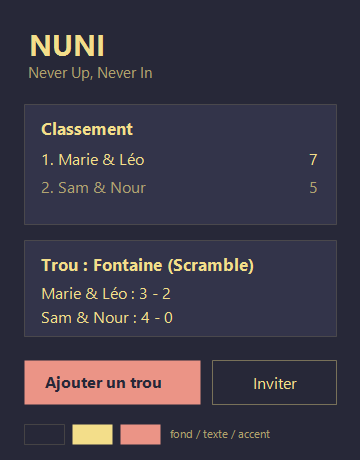
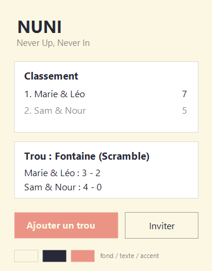
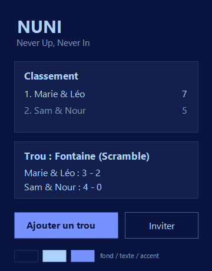
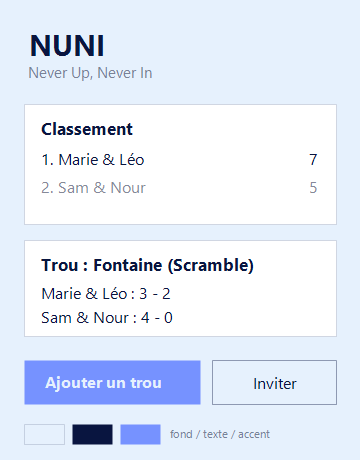
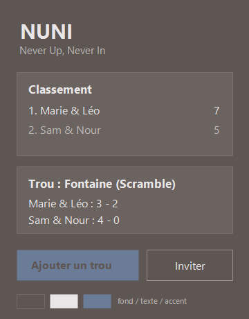
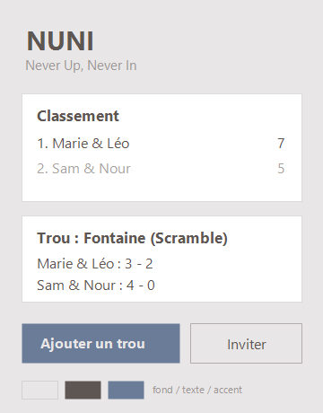

# Palette NUNI — essais et décisions

Fichier unique de synthèse des essais de palette. Les fichiers de chaque essai (maquette HTML
source, captures PNG) sont rangés dans `essais/<numéro>_<hex1>-<hex2>-<hex3>/`. Question
associée : Q1 / Q1b dans [QUESTIONS_PO.md](../QUESTIONS_PO.md).

Note sur les maquettes HTML : un aperçu Markdown ne rend pas les fichiers `.html`. Chaque essai
donne un lien `file://` à ouvrir dans un navigateur (valable sur ce poste) ; sur GitHub, ouvrir le
fichier puis le bouton "Raw". Les PNG intégrés restent la référence visuelle rapide.

## Index

| # | Source | Couleurs | Dossier | Statut |
|---|--------|----------|---------|--------|
| 01 | https://coolors.co/272838-f3de8a-eb9486 | `#272838` `#F3DE8A` `#EB9486` | [essais/01_272838-f3de8a-eb9486](essais/01_272838-f3de8a-eb9486) | codée (A et B), non active |
| 02 | https://coolors.co/091540-7692ff-abd2fa | `#091540` `#7692FF` `#ABD2FA` | [essais/02_091540-7692ff-abd2fa](essais/02_091540-7692ff-abd2fa) | codée (A et B), non active |
| 03 | "Urban slate" (capture Figma fournie par le PO, 5 couleurs) | retenues : `#E9E6E7` `#5E5653` `#6B7C98` (écartées : `#7B7F8A` `#AB978C`) | [essais/03_e9e6e7-5e5653-6b7c98](essais/03_e9e6e7-5e5653-6b7c98) | **03-B active** ; 03-A exclue |

Décision (Q1b, 2026-09-14) : les cinq variantes viables (01-A, 01-B, 02-A, 02-B, 03-B) sont
définies dans le code de l'app ; **03-B "Urban claire" est la palette active**. Le changement de
palette se fait uniquement par une référence dans le code (`core/theme/palettes.dart`, constante
`activePalette`), jamais par un réglage utilisateur. Chaque variante définit exactement les
5 couleurs nommées (fond, texte, accent, erreur, succès) plus la couleur de cartouche dérivée.

## Règle du jeu (rappel)

- 3 couleurs d'entrée fournies par le PO : **fond**, **texte**, **accent**.
- 2 couleurs sémantiques fixes choisies par Claude : **erreur** `#E24B4A`, **succès** `#1D9E75`.
- Tout le reste est dérivé, jamais par nouvelle teinte :
  - cartouches : fond mélangé à 6 % de texte (répartition sombre) ou blanc (répartition claire) ;
  - bordures, séparateurs : texte à 15 % d'opacité ;
  - texte secondaire : texte à 60 % ; désactivé : 40 % ;
  - sélection / focus : accent à 12 % en fond, accent plein en contour ;
  - texte sur bouton accent : la couleur de fond.
- Contraste minimum texte/fond : 4,5:1 (WCAG AA), vérifié à chaque essai.
- Chaque essai est décliné en deux répartitions : **A sombre** (la couleur la plus foncée sert de
  fond) et **B claire** (la couleur la plus claire, éclaircie par mélange au blanc, sert de fond ;
  cartouches blancs).

Gabarit d'un essai : source, tableau des valeurs, contrastes, maquettes A et B, avis, décision.

---

## Essai 01 — 2026-09-14

Source : https://coolors.co/272838-f3de8a-eb9486
Maquette HTML (source des rendus) : `essais/01_272838-f3de8a-eb9486/maquette.html`
— ouvrir dans un navigateur : [file:///C:/Users/bruno/repos/nuni/docs/design/essais/01_272838-f3de8a-eb9486/maquette.html](file:///C:/Users/bruno/repos/nuni/docs/design/essais/01_272838-f3de8a-eb9486/maquette.html)
(les aperçus Markdown n'ouvrent pas les fichiers HTML ; les PNG ci-dessous en sont le rendu).

| Couleur | Hex | Rôle |
|---|---|---|
| Bleu nuit | `#272838` | fond (A) ou texte (B) |
| Jaune pâle | `#F3DE8A` | texte (A) ou base du fond éclairci (B) |
| Corail | `#EB9486` | accent (A et B) |

### 01-A sombre

| Rôle | Valeur | Contraste sur le fond |
|---|---|---|
| fond | `#272838` | — |
| texte | `#F3DE8A` | 10,4:1 |
| accent | `#EB9486` | 6,0:1 (texte `#272838` sur accent : 6,0:1) |
| cartouche | `#33344A` | — |

### 01-B claire

| Rôle | Valeur | Contraste sur le fond |
|---|---|---|
| fond | `#FCF7E3` (`#F3DE8A` + ~75 % blanc) | — |
| texte | `#272838` | 12,3:1 |
| accent | `#EB9486` | bouton plein, texte `#272838` dessus : 6,0:1 |
| cartouche | `#FFFFFF` | — |

### Avis

- A : les trois couleurs sont utilisées telles quelles, aucune couleur neutre ajoutée ; palette
  chaude, contrastée, très identifiable. Réserve : lisibilité en plein soleil à vérifier.
- B : lecture confortable en extérieur, mais le jaune n'apparaît plus qu'en teinte de fond et le
  blanc entre comme neutre.

Décision : candidate, Q1b ouverte.

---

## Essai 02 — 2026-09-14

Source : https://coolors.co/091540-7692ff-abd2fa
Maquette HTML (source des rendus) : `essais/02_091540-7692ff-abd2fa/maquette.html`
— ouvrir dans un navigateur : [file:///C:/Users/bruno/repos/nuni/docs/design/essais/02_091540-7692ff-abd2fa/maquette.html](file:///C:/Users/bruno/repos/nuni/docs/design/essais/02_091540-7692ff-abd2fa/maquette.html)

| Couleur | Hex | Rôle |
|---|---|---|
| Bleu marine profond | `#091540` | fond (A) ou texte (B) |
| Bleu pervenche | `#7692FF` | accent (A et B) |
| Bleu ciel | `#ABD2FA` | texte (A) ou base du fond éclairci (B) |

### 02-A sombre

| Rôle | Valeur | Contraste sur le fond |
|---|---|---|
| fond | `#091540` | — |
| texte | `#ABD2FA` | 11,3:1 |
| accent | `#7692FF` | 6,2:1 (texte `#091540` sur accent : 6,2:1) |
| cartouche | `#131F4C` | — |

### 02-B claire

| Rôle | Valeur | Contraste sur le fond |
|---|---|---|
| fond | `#E6F1FD` (`#ABD2FA` + ~70 % blanc) | — |
| texte | `#091540` | 15,5:1 |
| accent | `#7692FF` | bouton plein, texte `#091540` dessus : 6,2:1 ; **en texte sur le fond : 2,5:1, insuffisant** |
| cartouche | `#FFFFFF` | — |

### Avis

- A : palette froide, monochrome bleue, très cohérente et reposante ; contrastes excellents. Les
  trois couleurs sont utilisées telles quelles. Moins de "chaleur" que l'essai 01, l'accent se
  distingue moins du texte (deux bleus).
- B : le meilleur contraste texte/fond des quatre variantes ; en revanche l'accent pervenche est
  trop clair pour servir de couleur de texte ou de lien sur fond clair (2,5:1). Il resterait
  réservé aux boutons pleins et aux contours, ce qui est compatible avec la règle de dérivation
  mais limite son usage.
- Point commun aux deux essais : l'erreur `#E24B4A` (suppression, scores manquants) et le succès
  `#1D9E75` (leader, dernier trou) se détachent nettement des deux palettes.

Décision : candidate, Q1b ouverte.

---

## Essai 03 — 2026-09-14 — "Urban slate"

Source : palette "Urban slate" en 5 couleurs, capture Figma fournie par le PO :
`#E9E6E7`, `#5E5653`, `#7B7F8A`, `#AB978C`, `#6B7C98`.
Maquette HTML (source des rendus, avec les 5 couleurs et les 3 retenues encadrées) :
`essais/03_e9e6e7-5e5653-6b7c98/maquette.html`
— ouvrir dans un navigateur : [file:///C:/Users/bruno/repos/nuni/docs/design/essais/03_e9e6e7-5e5653-6b7c98/maquette.html](file:///C:/Users/bruno/repos/nuni/docs/design/essais/03_e9e6e7-5e5653-6b7c98/maquette.html)

### Choix des 3 couleurs (proposition Claude)

| Couleur | Hex | Rôle | Pourquoi |
|---|---|---|---|
| Gris clair | `#E9E6E7` | fond | la seule couleur claire de la palette |
| Taupe foncé | `#5E5653` | texte | la plus foncée ; 5,8:1 sur le fond (AA) |
| Bleu acier | `#6B7C98` | accent | la seule couleur chromatique ; 3,4:1 sur le fond, suffisant pour boutons pleins et contours, pas pour du texte courant |
| Gris ardoise | `#7B7F8A` | écartée | 3,2:1 sur le fond, trop proche du bleu acier sans en avoir la teinte |
| Beige | `#AB978C` | écartée | 2,2:1 sur le fond, inutilisable pour un rôle |

### 03-A sombre (non viable)

| Rôle | Valeur | Contraste sur le fond |
|---|---|---|
| fond | `#5E5653` | — |
| texte | `#E9E6E7` | 5,8:1 |
| accent | `#6B7C98` | **1,7:1, insuffisant** |
| cartouche | `#6A6360` | — |

### 03-B claire

| Rôle | Valeur | Contraste sur le fond |
|---|---|---|
| fond | `#E9E6E7` | — |
| texte | `#5E5653` | 5,8:1 |
| accent | `#6B7C98` | 3,4:1 ; texte `#E9E6E7` sur bouton accent : 3,4:1 (texte large et gras seulement) |
| cartouche | `#FFFFFF` | — |

### Avis

- Palette la plus sobre et la plus "urbaine" des trois, cohérente avec le nom NUNI et le street
  golf. Contraste texte/fond correct mais nettement inférieur aux essais 01 et 02 (5,8:1 contre
  10 à 15:1), ce qui se sentira en plein soleil.
- L'accent est discret : les boutons se distinguent par leur teinte plus que par leur contraste.
  Les couleurs sémantiques erreur `#E24B4A` et succès `#1D9E75` ressortiront d'autant plus.
- Seule la répartition claire est viable ; la sombre est documentée pour mémoire.

Décision : candidate (claire uniquement), Q1b ouverte.
