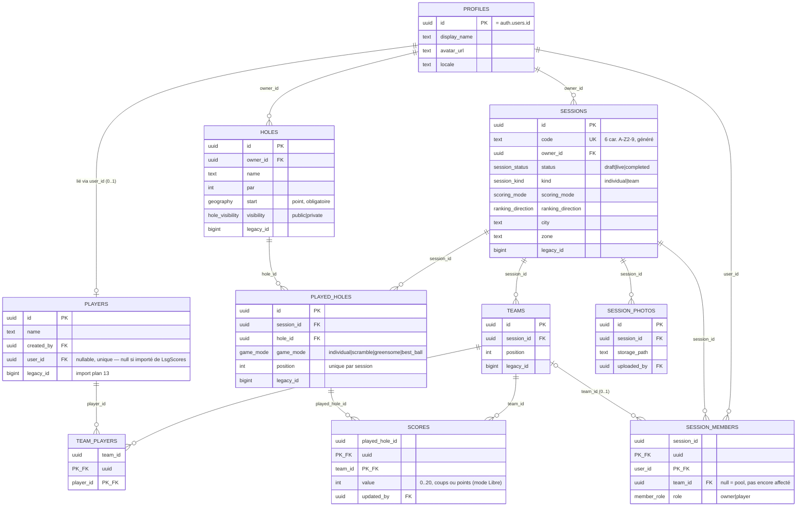

# Modèle de données NUNI (plan 03)

Schéma effectivement poussé sur le projet Supabase `nuni`, à jour avec
`supabase/migrations`. Toute modification de ce document doit suivre une modification des
migrations (voir AGENTS.md, point 8 : avant la première mise en service, on édite les fichiers
existants, on ne les empile pas).

## Diagramme

## Enums Postgres (miroir des enums Dart, Q6)

| Enum | Valeurs |
|---|---|
| `hole_visibility` | `public`, `private` |
| `session_status` | `draft`, `live`, `completed` |
| `session_kind` | `individual`, `team` |
| `scoring_mode` | `stroke_play`, `match_play`, `redistribution`, `free` |
| `ranking_direction` | `asc`, `desc` (libre en mode `free`, Q7b) |
| `game_mode` | `individual`, `scramble`, `greensome`, `best_ball` |
| `member_role` | `owner`, `player` |

## Politiques d'accès (RLS)

Toutes les tables ci-dessus ont RLS activée, ciblant uniquement le rôle `authenticated` (l'app
exige une connexion Google partout ; seuls les buckets de stockage sont lisibles anonymement).
Deux fonctions `security definer` évitent les politiques récursives :
`is_session_member(session_id)` et `is_session_owner(session_id)` (propriétaire au sens large :
créateur ou co-organisateur promu, `session_members.role = 'owner'`).

Résumé par table (détail exact dans `supabase/migrations/20260915100400_rls.sql`) :

| Table | Lecture | Écriture |
|---|---|---|
| `profiles` | tout authentifié | soi-même |
| `players` | tout authentifié | le joueur lié (`user_id`) ; aucune création cliente (Q24) |
| `holes` | public, mes trous, ou joué dans une session dont je suis membre (Q13) | propriétaire |
| `sessions` | membres | propriétaire (modif/suppr) ; insertion par l'auteur |
| `teams`, `team_players` | membres | propriétaire, tant que `draft` (Q15) |
| `session_members` | membres | soi-même (rejoindre via RPC, quitter si `draft`) ; propriétaire (ajouter si `draft`, retirer, changer l'équipe si `draft` ou promouvoir un rôle sinon — `team_id` gelé après `draft` par trigger, Q15) |
| `played_holes` | membres | propriétaire |
| `scores` | membres | propriétaire/co-organisateur pour toute équipe ; un membre pour sa propre équipe (Q8) |
| `session_photos` | membres | propriétaire |

Important : RLS ne fait que filtrer les lignes. Les privilèges de base (`GRANT SELECT/INSERT/…`)
au rôle `authenticated` sont accordés explicitement dans `20260915100400_rls.sql` — les privilèges
par défaut de Supabase pour ce rôle ne s'appliquent pas aux objets créés par le rôle utilisé par le
CLI de migration (vérifié : sans ce `GRANT` explicite, `authenticated` n'a aucun accès, RLS ou pas).

## RPC

- `holes_nearby(lat, lng, radius_m)` — trous à proximité (`security invoker`, la visibilité vient
  entièrement de la politique RLS de `holes`).
- `join_session(code)` — rejoindre par code (Q15/plan 09) : pool si aucune équipe, équipe du
  joueur lié si déjà composée, erreur `not_in_team` sinon.
- `create_session(payload)` — création en `draft`, équipes facultatives. Forme du payload
  provisoire (plan 07 pas encore écrit) : `{kind, scoring_mode, ranking_direction, city?, zone?,
  location? {lat,lng}, comment?, teams? [{position, player_ids[]}]}`.
- `start_session(session_id)` — passage en `live` (Q25) : une équipe par participant en
  individuel, aucun participant non affecté en équipe.

Ces quatre fonctions, plus `is_session_member`/`is_session_owner`, ont leur droit d'exécution par
défaut à `PUBLIC` révoqué puis regranté uniquement à `authenticated` (sinon un utilisateur non
connecté peut les appeler).

## Temps réel et stockage

Publication `supabase_realtime` : `sessions`, `teams`, `team_players`, `session_members`,
`played_holes`, `scores` (tables suivies par l'écran de session en direct, plan 08).

Buckets de stockage (lecture publique, écriture par le propriétaire du premier segment du
chemin — `user_id` pour `avatars`/`holes`, `session_id` pour `session-photos`) : `avatars`,
`holes`, `session-photos`.

## Vérifié, non vérifié

- Schéma reconstruit sans erreur depuis zéro sur le projet distant (`npx supabase db push`).
- `npx supabase db advisors` : correctifs appliqués (recherche de schéma des fonctions, révocation
  de l'exécution par `anon`, performance des politiques RLS). Restent acceptés en l'état :
  `spatial_ref_sys` sans RLS (table système PostGIS, rôle de migration non propriétaire — la voie
  propre serait l'éditeur SQL du tableau de bord, non tentée), extension PostGIS dans le schéma
  `public` (déplacement risqué, sans gain réel ici), plusieurs politiques permissives par table
  (choix délibéré de lisibilité).
- Test RLS/RPC réel (`supabase/tests/rls_smoke.sql`, exécuté manuellement contre `nuni` avec
  nettoyage) : 9/9 vérifications passées, y compris après correction d'un bug réel trouvé par ce
  test (une ambiguïté de nom de colonne rendait la politique d'écriture des scores inopérante :
  n'importe quel membre pouvait écrire le score de n'importe quelle équipe, pas seulement la
  sienne).
- `supabase/seed.sql` exécuté une fois contre `nuni` pour vérification puis nettoyé (le projet
  distant reste vide jusqu'à la première vraie connexion) ; pas rejoué via `supabase start` +
  `db reset` (Docker local non confirmé sur ce poste).
