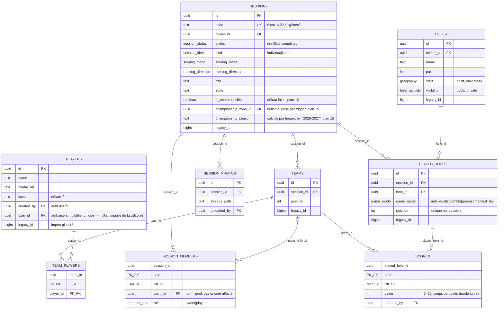

# Modèle de données NUNI (plan 03)

Schéma effectivement poussé sur le projet Supabase `nuni`, à jour avec
`supabase/migrations`. Toute modification de ce document doit suivre une modification des
migrations (voir AGENTS.md, point 8 : avant la première mise en service, on édite les fichiers
existants, on ne les empile pas).

## Diagramme

Pas de table `profiles` séparée : avec Q24, un profil et son joueur lié étaient toujours créés
ensemble et resynchronisés à chaque sauvegarde -- deux tables identiques en pratique. `players`
porte directement les réglages de compte (nom, avatar, langue) et référence `auth.users`
directement (décision PO, 2026-09-16).

`players.user_id`, `holes.owner_id`, `sessions.owner_id`, `session_members.user_id`,
`scores.updated_by`, `session_photos.uploaded_by` et `user_roles.user_id` référencent tous
`auth.users` (géré par Supabase, hors de ce schéma), non représenté dans le diagramme ci-dessous.

`user_roles` (plan 16) n'est pas dans le diagramme ci-dessous, qui décrit le domaine
sessions/scores : c'est une table à part, sans autre relation que `auth.users`, `user_id uuid PK
FK` + `role app_role` (`player`|`super_admin`, défaut `player`) + `created_at`. Ne contient que
les exceptions (les `super_admin`) ; un compte absent de la table est un `player` implicite.

`championship_zones` (plan 15) n'est pas non plus dans le diagramme ci-dessous : `id uuid PK` +
`created_at`, volontairement sans colonne `name` (le nom affiché se déduit à la lecture,
`championship_zone_label`, jamais stocké). `sessions.championship_zone_id` y réfère (nullable) ;
elle n'a aucune autre relation.

## Enums Postgres (miroir des enums Dart, Q6)

| Enum | Valeurs |
|---|---|
| `hole_visibility` | `public`, `private` |
| `session_status` | `draft`, `live`, `completed` |
| `session_kind` | `individual`, `team` |
| `scoring_mode` | `stroke_play`, `match_play`, `redistribution`, `free` |
| `ranking_direction` | `asc`, `desc` (libre en mode `free`, Q7b) |
| `game_mode` | `individual`, `scramble`, `greensome`, `best_ball` |
| `member_role` | `owner`, `player` (rôle **dans une session** — sans rapport avec `app_role`) |
| `app_role` | `player`, `super_admin` (rôle **applicatif**, plan 16) |

## Politiques d'accès (RLS)

Toutes les tables ci-dessus, plus `user_roles` et `championship_zones`, ont RLS activée, ciblant
uniquement le rôle `authenticated` (l'app exige une connexion Google partout ; seuls les buckets de
stockage sont lisibles anonymement). Cinq fonctions `security definer` évitent les politiques
récursives : `is_session_member(session_id)` et `is_session_owner(session_id)` (propriétaire au
sens large : créateur ou co-organisateur promu, `session_members.role = 'owner'`),
`is_super_admin()` (plan 16, rôle applicatif `user_roles.role = 'super_admin'` — pas encore
référencée par une politique existante, prête pour de futures actions structurantes), et
`assign_championship_zone(session)`/`championship_zone_label(zone_id)` (plan 15, lisent/écrivent
`championship_zones` et `sessions` à travers toute session championnat, pas seulement celles du
caller).

Résumé par table (détail exact dans `supabase/migrations/20260915100400_rls.sql`) :

| Table | Lecture | Écriture |
|---|---|---|
| `user_roles` | soi-même seulement | aucune (accès direct base, clé service, plan 16) |
| `championship_zones` | tout authentifié (un classement n'est pas confidentiel) | aucune (seule `assign_championship_zone`, security definer, y écrit) |
| `players` | tout authentifié | le joueur lié (`user_id`) ; aucune création cliente (Q24) |
| `holes` | public, mes trous, ou joué dans une session dont je suis membre (Q13) | propriétaire |
| `sessions` | membres | propriétaire (modif/suppr, dont `is_championship`) ; insertion par l'auteur ; `championship_zone_id`/`championship_season` gelés par trigger, jamais posés par le client |
| `teams`, `team_players` | membres | propriétaire, tant que `draft` (Q15) |
| `session_members` | membres | soi-même (rejoindre via RPC, quitter si `draft`) ; propriétaire (ajouter si `draft`, retirer, changer l'équipe si `draft` ou promouvoir un rôle sinon — `team_id` gelé après `draft` par trigger, Q15) |
| `played_holes` | membres | propriétaire |
| `scores` | membres | propriétaire/co-organisateur pour toute équipe ; un membre pour sa propre équipe (Q8) |
| `session_photos` | membres | propriétaire |

Important : RLS ne fait que filtrer les lignes. Les privilèges de base (`GRANT SELECT/INSERT/…`)
au rôle `authenticated` sont accordés explicitement dans `20260915100400_rls.sql` — les privilèges
par défaut de Supabase pour ce rôle ne s'appliquent pas aux objets créés par le rôle utilisé par le
CLI de migration (vérifié : sans ce `GRANT` explicite, `authenticated` n'a aucun accès, RLS ou pas).

## RPC

- `holes_nearby(lat, lng, radius_m)` — trous à proximité (`security invoker`, la visibilité vient
  entièrement de la politique RLS de `holes`).
- `join_session(code)` — rejoindre par code (Q15/plan 09) : pool si aucune équipe, équipe du
  joueur lié si déjà composée, erreur `not_in_team` sinon.
- `create_session(payload)` — création en `draft`, équipes facultatives. Forme du payload
  provisoire (plan 07 pas encore écrit) : `{kind, scoring_mode, ranking_direction, city?, zone?,
  location? {lat,lng}, comment?, teams? [{position, player_ids[]}]}`.
- `start_session(session_id)` — passage en `live` (Q25) : une équipe par participant en
  individuel, aucun participant non affecté en équipe.
- `session_snapshot(session_id)` / `history_snapshots()` — le détail complet d'une session (plan
  08/10), et l'historique des sessions terminées du caller, chacune shapée pareil.
- `championship_zone_results(zone_id, season)` (plan 15) — même forme qu'un `session_snapshot`,
  agrégée sur toutes les sessions championnat terminées d'une zone/saison, indépendamment de la
  qualité de membre du caller (`security definer`) ; le calcul du classement (points, égalités)
  se fait en Dart à la lecture (`features/championship/domain`), jamais stocké.

Ces fonctions, plus `is_session_member`/`is_session_owner`/`is_super_admin`/
`assign_championship_zone`/`championship_zone_label`, ont leur droit d'exécution par défaut à
`PUBLIC` révoqué puis regranté uniquement à `authenticated` (sinon un utilisateur non connecté
peut les appeler).

## Temps réel et stockage

Publication `supabase_realtime` : `sessions`, `teams`, `team_players`, `session_members`,
`played_holes`, `scores` (tables suivies par l'écran de session en direct, plan 08).

Buckets de stockage (lecture publique, écriture par le propriétaire du premier segment du
chemin — `user_id` pour `avatars`/`holes`, `session_id` pour `session-photos`) : `avatars`,
`holes`, `session-photos`.

## Vérifié, non vérifié

- Schéma reconstruit sans erreur depuis zéro sur le projet distant (`npx supabase db push`).
- `npx supabase db advisors` : correctifs appliqués (recherche de schéma des fonctions, révocation
  de l'exécution par `anon`, performance des politiques RLS). Restent acceptés en l'état :
  `spatial_ref_sys` sans RLS (table système PostGIS, rôle de migration non propriétaire — la voie
  propre serait l'éditeur SQL du tableau de bord, non tentée), extension PostGIS dans le schéma
  `public` (déplacement risqué, sans gain réel ici), plusieurs politiques permissives par table
  (choix délibéré de lisibilité).
- Test RLS/RPC réel (`supabase/tests/rls_smoke.sql`, exécuté manuellement contre `nuni` avec
  nettoyage) : 9/9 vérifications passées, y compris après correction d'un bug réel trouvé par ce
  test (une ambiguïté de nom de colonne rendait la politique d'écriture des scores inopérante :
  n'importe quel membre pouvait écrire le score de n'importe quelle équipe, pas seulement la
  sienne).
- `supabase/seed.sql` exécuté deux fois contre `nuni` pour vérification puis nettoyé à chaque fois ;
  pas rejoué via `supabase start` + `db reset` (Docker local non confirmé sur ce poste).
- 2026-09-16 : fusion `profiles`/`players` (redondance constatée par le PO après une première
  vraie connexion Google — les deux tables étaient toujours 1:1 et resynchronisées à chaque
  sauvegarde). Schéma distant reconstruit depuis zéro ; le compte réel du PO, déjà connecté avant
  la reconstruction, a perdu sa ligne `players` (le trigger ne se redéclenche qu'à la création du
  compte `auth.users`, pas à chaque connexion) — recréée à la main avec les mêmes valeurs que le
  trigger aurait posées, vérifié en base après coup. `db advisors` et `rls_smoke.sql` (9/9)
  repassés après la reconstruction, aucune régression.
- 2026-09-22 (plan 15, championnat) : première tentative de `db push` refusée par Postgres
  (`generation expression is not immutable`, SQLSTATE 42P17) — `extract()` sur un `timestamptz`
  n'est que `STABLE`, invalide pour une colonne générée. `championship_season` corrigée en colonne
  normale calculée par trigger (voir ci-dessus), schéma distant reconstruit depuis zéro avec
  succès ensuite. `rls_smoke.sql` (9/9) et un script de vérification dédié au mécanisme du plan 15
  (non committé, ad hoc) : zone assignée au premier tagage, saison dérivée de `started_at`, une
  session proche (< 15 km) rejoint la même zone, une lointaine en fonde une autre, la zone reste
  gelée après un démarquage/remarquage, le tagage sans position connue est refusé,
  `championship_zone_label` renvoie la ville majoritaire, `championship_zone_results` n'expose que
  les sessions championnat *terminées* de la zone/saison à un non-membre sans élargir l'accès à la
  ligne `sessions` brute — 10/10 passés.
